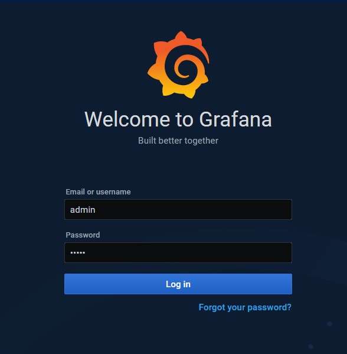
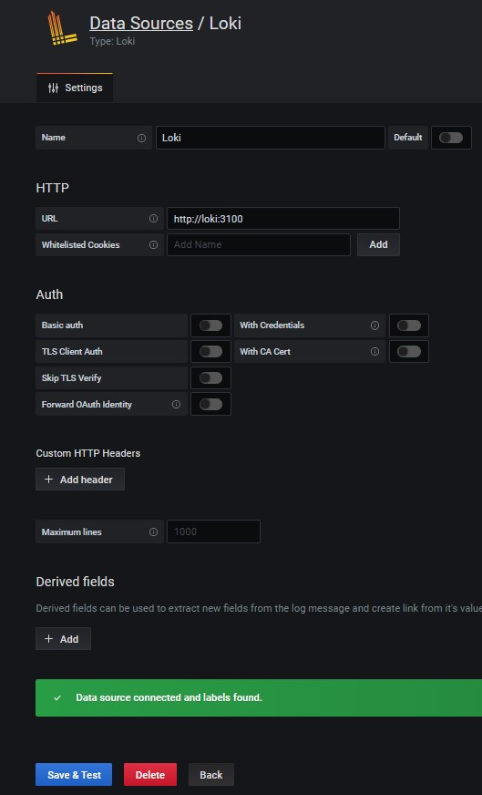
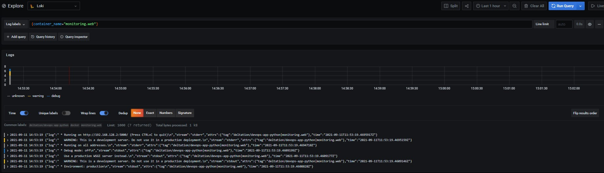
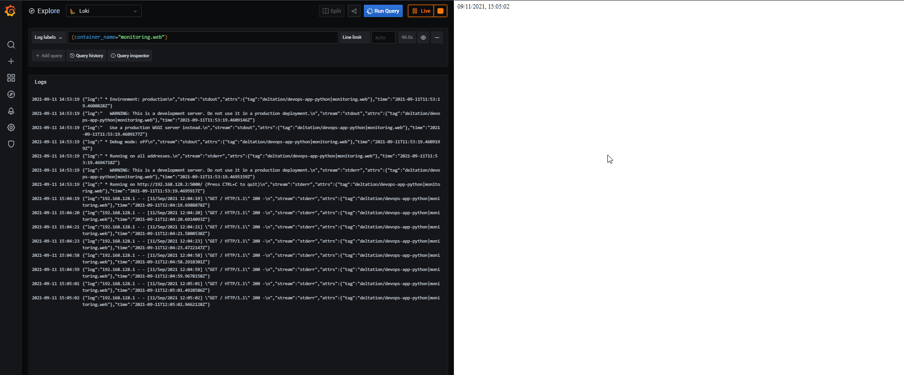

# Monitoring: logging

The logging stack is based on the example of the provided repo: <https://github.com/black-rosary/loki-nginx>.

The stack consists of the following services:

- `cadvisor`: provides metrics of running docker containers
- `web`: the web application (`app_python`)
- `grafana`: Grafana service
- `promtail`: logs provider for `loki`
- `loki`: log aggregation system

## Report

The stack can be launched via ```docker-compose up```.

After it is launched, Grafana can be access at <http://localhost:3000>. Use `admin` as both username and password:


Loki data sources can be added by clicking the  add data source button ans selecting Loki.

Loki can be access with <http://loki:3100>, thus this URL has to be inserted into the required field. "Save & Test" button verifies that all information is correct.


In the Explore section, we can query logs. The following screenshots demonstrates querying logs from the web application:


The web app can be accessed at <http://localhost:5000/>. By having live logs stream enabled and refreshing the web app page, we can observe how the logs of the HTTP requests appear:


## Best Practices

### Grafana

- A dashboard should tell a story or answer a question.
- Dashboards should reduce cognitive load, not add to it.
- Avoid unnecessary dashboard refreshing to reduce the load on the network or backend.
- Copying dashboards with no significant changes is not a good idea.
- Maintain a dashboard of dashboards or cross-reference dashboards
- Grafana retrieves data from a data source. A basic understanding of data sources in general and your specific is important.

### Loki

- Static labels are good
- Use dynamic labels sparingly
- Configure caching
- Logs must be in increasing time order per stream

### References

- <https://grafana.com/docs/grafana/latest/best-practices/best-practices-for-creating-dashboards/>
- <https://grafana.com/docs/grafana/latest/best-practices/best-practices-for-managing-dashboards/>
