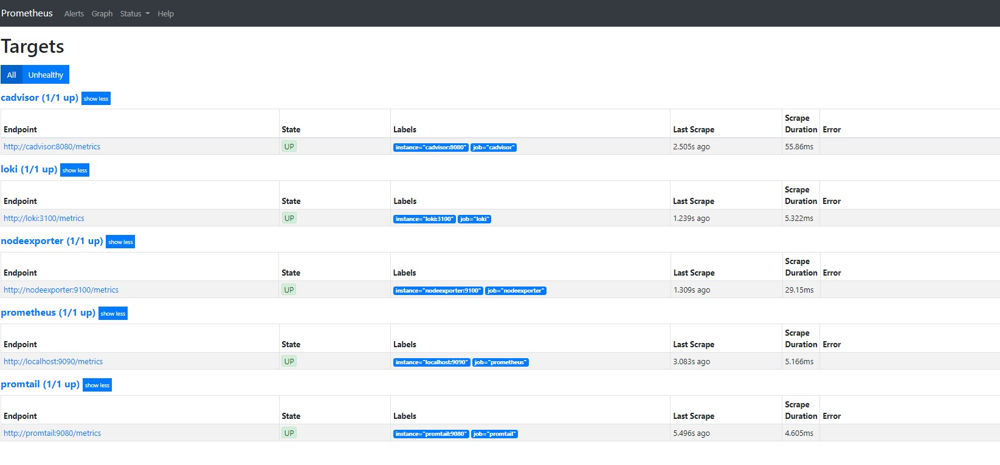
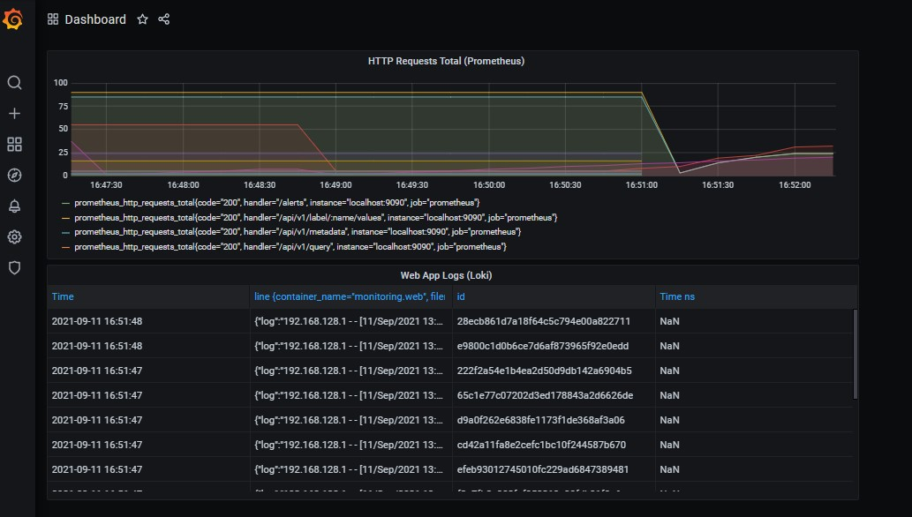

# Monitoring: metrics

The logging stack is based on the example of the provided repo: <https://github.com/black-rosary/loki-nginx>.

Apart from the logging services, the stack now consists of the following items:

- `prometheus`: service for Prometheus
- `nodeexporter`: exporter for machine metrics

## Report

The stack can be launched via ```docker-compose up```.

After it is launched, Prometheus is available at <http://localhost:9090>.

Prometheus discovered all targets successfully (<http://localhost:9090/targets>):


The following is a screenshot of the created Grafana dashboard:


The top chart displays total Prometheus HTTP requests while the bottom table contains Loki logs from the web app.
